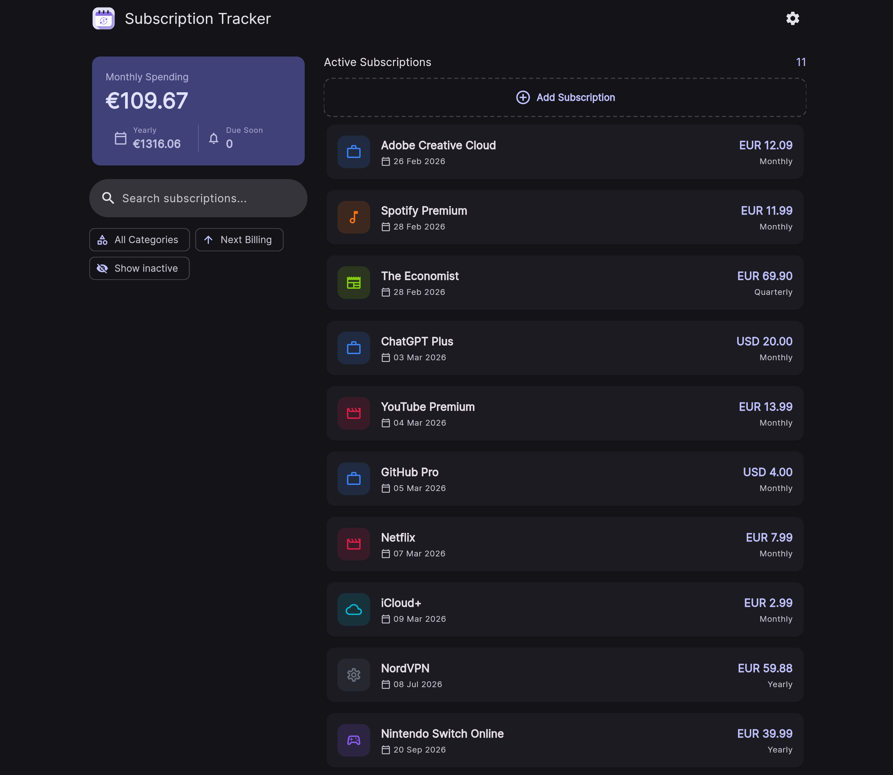
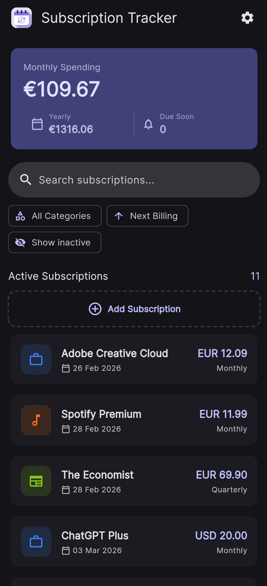
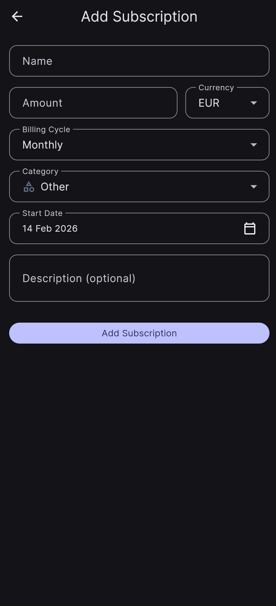
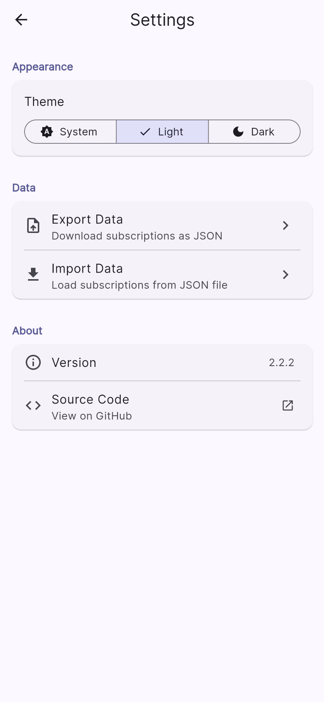

# SubTracker


A full-stack subscription management app built with **Flutter** and **.NET 10**. Track recurring expenses, visualize monthly and yearly spending, get notified before bills are due, and stay on top of your subscriptions across web, mobile, and desktop.

## Screenshots

<table align="center">
  <tr>
    <td colspan="3" align="center">
      
      <br /><sub><b>Dashboard — Desktop (Dark Mode)</b></sub>
    </td>
  </tr>
  <tr>
    <td align="center">
      
      <br /><sub><b>Dashboard — Mobile</b></sub>
    </td>
    <td align="center">
      
      <br /><sub><b>Add Subscription</b></sub>
    </td>
    <td align="center">
      
      <br /><sub><b>Settings — Light Mode</b></sub>
    </td>
  </tr>
</table>

## Features

- **Subscription tracking** -- manage name, amount, currency (EUR/USD/GBP), billing cycle, category, start date, and URL
- **Spending overview** -- monthly and yearly totals calculated from all active subscriptions, normalized across billing cycles
- **Due soon alerts** -- visual indicators for subscriptions due within a configurable window (0-30 days)
- **Push notifications** -- automatic Pushover alerts for upcoming bills via a background job
- **Search, filter, and sort** -- find subscriptions by name, description, or category; sort by date, name, amount, or category
- **Swipe actions** -- pause/resume or delete subscriptions with swipe gestures
- **Active/Inactive toggle** -- pause tracking without losing data
- **Settings & themes** -- system/light/dark theme selector with persistent preferences
- **Data management** -- export/import subscriptions as JSON files with validation
- **Cross-platform** -- runs on Web, macOS, iOS, Android, Linux, and Windows
- **Demo data** -- seeds 12 realistic subscriptions in development mode for quick testing

## Tech Stack

| Layer        | Technology                                                                    |
| ------------ | ----------------------------------------------------------------------------- |
| **Frontend** | Flutter 3.x, Riverpod 2.x (code-gen), GoRouter, Material 3, SharedPreferences |
| **Backend**  | .NET 10, FastEndpoints, Entity Framework Core, SQLite, Serilog                |
| **Infra**    | Docker, docker-compose                                                        |
| **Testing**  | Flutter test, xUnit, very_good_analysis                                       |

## Architecture

```
Flutter UI --> Riverpod AsyncNotifier --> HTTP API Service --> .NET FastEndpoints --> SQLite
```

Both frontend and backend follow a **Vertical Slice Architecture** -- each feature is self-contained with its own models, services, state management, and UI components.

<details>
<summary>Project structure</summary>

```
sub-tracker/
├── lib/                             # Flutter frontend
│   ├── core/
│   │   ├── constants/               # App constants + env config
│   │   ├── extensions/              # DateTime extension methods
│   │   ├── providers/               # API service Riverpod providers
│   │   ├── router/                  # GoRouter configuration
│   │   ├── services/                # Generic HTTP API client
│   │   └── theme/                   # Material 3 theming (light + dark)
│   ├── features/
│   │   ├── settings/
│   │   │   ├── providers/           # ThemeModeNotifier with SharedPreferences
│   │   │   ├── screens/             # SettingsScreen
│   │   │   ├── services/            # FileService for import/export
│   │   │   └── widgets/             # ThemeSelector, ExportButton, ImportButton, AboutSection
│   │   └── subscriptions/
│   │       ├── models/              # Subscription, BillingCycle, Category, SortOption
│   │       ├── providers/           # Async Riverpod state management
│   │       ├── screens/             # HomeScreen, SubscriptionFormScreen
│   │       ├── services/            # Subscription API service
│   │       └── widgets/             # ListTile, SummaryCard, FilterSortBar
│   └── main.dart
│
├── api/                             # .NET backend
│   ├── src/SubTracker.Api/
│   │   ├── Common/                  # Shared abstractions (IDateTimeProvider, INotificationService)
│   │   ├── Database/                # EF Core DbContext + DatabaseSeeder
│   │   ├── Features/
│   │   │   ├── Subscriptions/       # CRUD endpoints + Domain + DTOs
│   │   │   └── Notifications/       # Pushover + Background Jobs
│   │   ├── Migrations/              # EF Core migrations
│   │   └── Program.cs
│   ├── tests/SubTracker.Api.Tests/  # xUnit domain tests
│   └── docker-compose.yml
│
├── test/                            # Flutter tests
├── .env.example                     # Environment template
└── README.md
```

</details>

## Getting Started

### Prerequisites

- [Flutter SDK](https://docs.flutter.dev/get-started/install) (>= 3.2.0)
- [.NET 10 SDK](https://dotnet.microsoft.com/download)
- [Docker](https://www.docker.com/) (optional, for containerized backend)

### 1. Clone the repository

```bash
git clone https://github.com/andrelupe/sub-tracker.git
cd sub-tracker
```

### 2. Start the backend

```bash
cd api/src/SubTracker.Api
dotnet run
```

The API starts on `http://localhost:5270` with Swagger at `http://localhost:5270/swagger`. In development mode, the database is auto-migrated and seeded with 12 demo subscriptions.

### 3. Start the frontend

```bash
# Back to the project root
cp .env.example .env

flutter pub get
dart run build_runner build --delete-conflicting-outputs
flutter run -d chrome
```

> Both the backend and frontend must be running simultaneously. The frontend reads the API URL from the `.env` file.

## API Endpoints

| Method   | Endpoint                    | Description                 |
| -------- | --------------------------- | --------------------------- |
| `GET`    | `/api/subscriptions`        | List all subscriptions      |
| `GET`    | `/api/subscriptions/{id}`   | Get subscription by ID      |
| `POST`   | `/api/subscriptions`        | Create a subscription       |
| `PUT`    | `/api/subscriptions/{id}`   | Update a subscription       |
| `DELETE` | `/api/subscriptions/{id}`   | Delete a subscription       |
| `POST`   | `/api/subscriptions/import` | Import subscriptions (JSON) |
| `GET`    | `/swagger`                  | Swagger UI documentation    |

## Docker

### All-in-One (Frontend + API)

```bash
docker run -d \
  -p 80:80 \
  -v subtracker-data:/data \
  -e ConnectionStrings__Default="Data Source=/data/subtracker.db" \
  andrelppereira/subtracker:latest
```

Open `http://localhost` to access the app.

### API Only

```bash
docker run -d \
  -p 5080:8080 \
  -v subtracker-data:/data \
  -e ConnectionStrings__Default="Data Source=/data/subtracker.db" \
  andrelppereira/subtracker-api:latest
```

### With Pushover Notifications

```bash
docker run -d \
  -p 80:80 \
  -v subtracker-data:/data \
  -e ConnectionStrings__Default="Data Source=/data/subtracker.db" \
  -e Pushover__ApiToken=your_token \
  -e Pushover__UserKey=your_key \
  andrelppereira/subtracker:latest
```

### Build locally

```bash
cd api
docker-compose up -d
```

## Configuration

### Frontend (.env)

```env
API_BASE_URL=http://localhost:5270/api
```

### Backend (appsettings.json)

```json
{
  "ConnectionStrings": {
    "Default": "Data Source=subtracker.db"
  },
  "Pushover": {
    "ApiToken": "YOUR_APP_TOKEN",
    "UserKey": "YOUR_USER_KEY"
  }
}
```

Pushover notifications are optional. Without valid credentials, the background job runs but notifications are silently skipped.

## Running Tests

```bash
# Flutter tests
flutter test

# .NET tests
cd api && dotnet test
```

## Contributing

1. Fork the repository
2. Create a feature branch (`git checkout -b feature/my-feature`)
3. Commit your changes (`git commit -m 'Add my feature'`)
4. Push to the branch (`git push origin feature/my-feature`)
5. Open a Pull Request

## Roadmap

| Version | Focus                           | Status     |
| ------- | ------------------------------- | ---------- |
| v2.2.0  | Settings, Themes, Import/Export | ✅ Done    |
| v2.3.0  | JWT Auth & Multi-currency       | 🔄 Next    |
| v2.4.0  | Analytics & Charts              | 📋 Planned |
| v2.5.0  | Multi-user support              | 📋 Planned |

See [ROADMAP.md](ROADMAP.md) for details.

## License

This project is licensed under the [MIT License](LICENSE).
