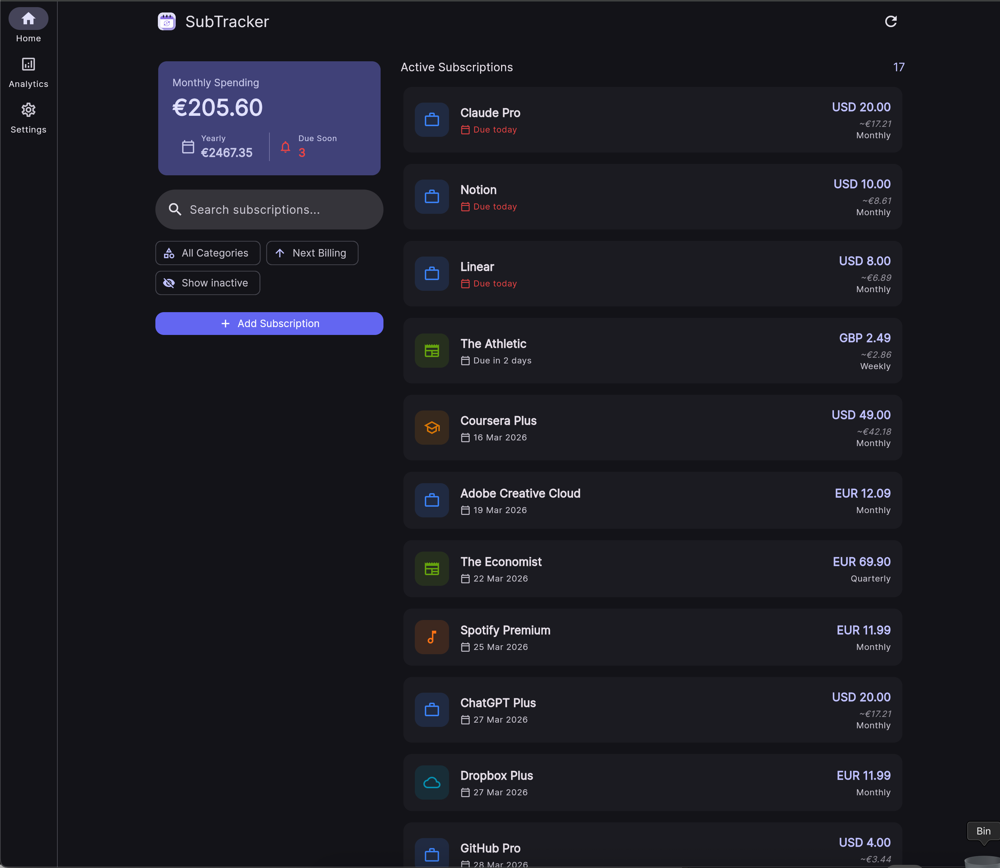
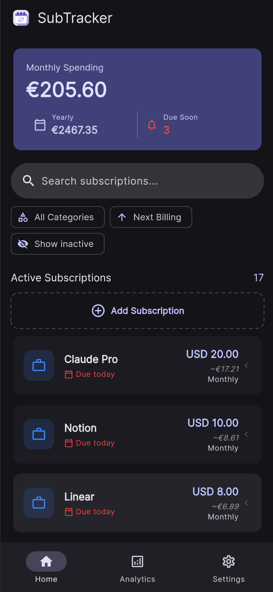
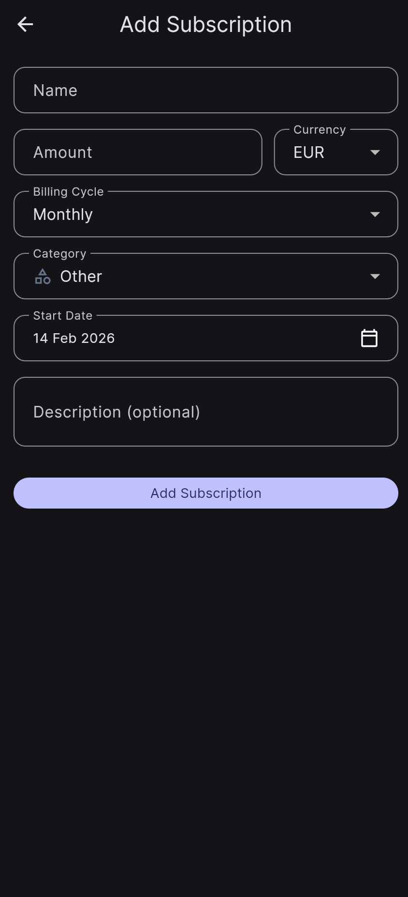
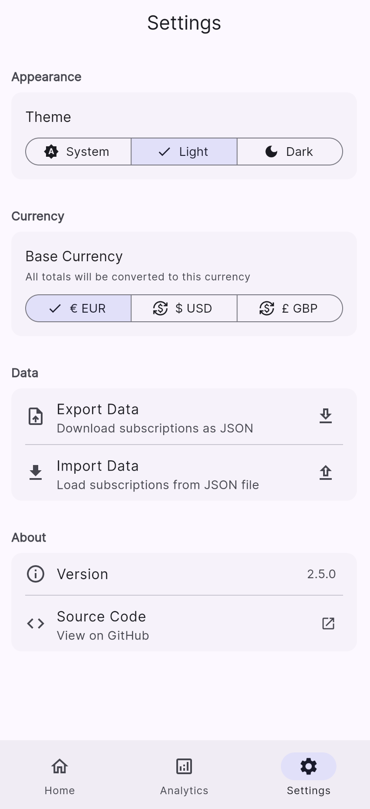
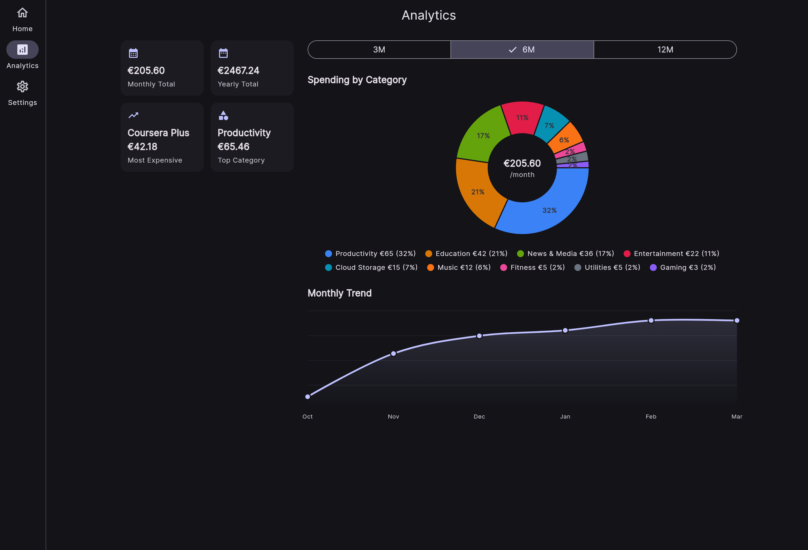
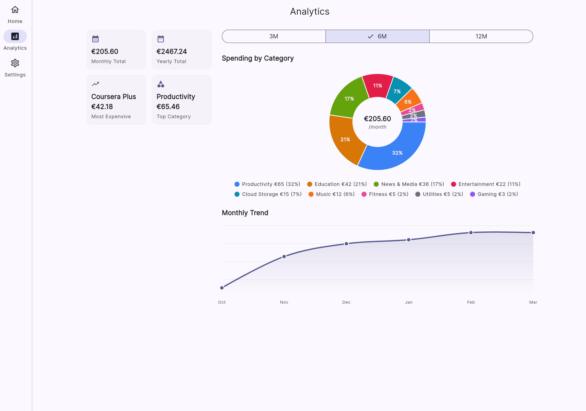
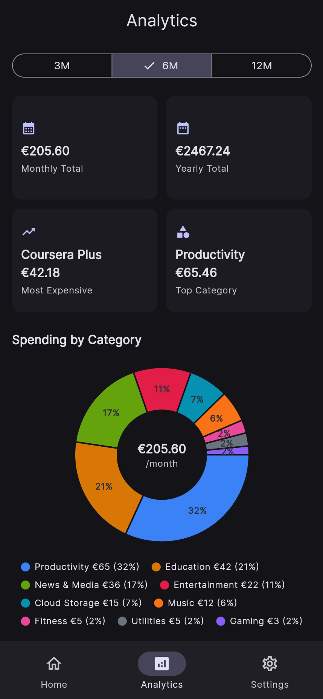
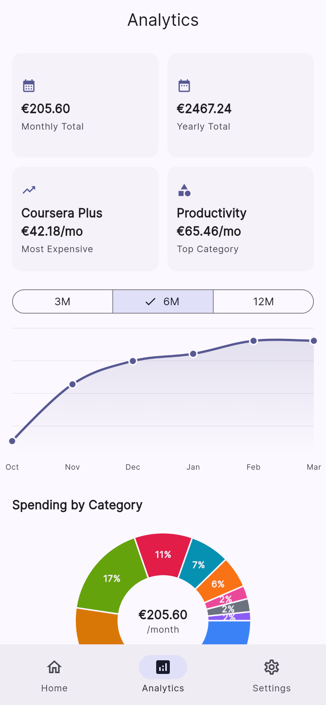

# SubTracker


A full-stack subscription management app built with **Flutter** and **.NET 10**. Track recurring expenses, visualize monthly and yearly spending, get notified before bills are due, and stay on top of your subscriptions across web, mobile, and desktop.

## Screenshots

<table align="center">
  <tr>
    <td colspan="3" align="center">
      
      <br /><sub><b>Dashboard — Desktop (Dark Mode)</b></sub>
    </td>
  </tr>
  <tr>
    <td align="center">
      
      <br /><sub><b>Dashboard — Mobile</b></sub>
    </td>
    <td align="center">
      
      <br /><sub><b>Add Subscription</b></sub>
    </td>
    <td align="center">
      
      <br /><sub><b>Settings — Light Mode</b></sub>
    </td>
  </tr>
  <tr>
    <td colspan="3" align="center">
      
      <br /><sub><b>Analytics — Desktop (Dark Mode)</b></sub>
    </td>
  </tr>
  <tr>
    <td colspan="3" align="center">
      
      <br /><sub><b>Analytics — Desktop (Light)</b></sub>
    </td>
  </tr>
  <tr>
    <td align="center">
      
      <br /><sub><b>Analytics — Mobile (Dark)</b></sub>
    </td>
    <td align="center">
      
      <br /><sub><b>Analytics — Mobile (Light)</b></sub>
    </td>
  </tr>
</table>

## Features

- **Subscription tracking** -- manage name, amount, currency (EUR/USD/GBP), billing cycle, category, start date, and URL
- **Multi-currency support** -- set a base currency (EUR/USD/GBP) and see converted totals; exchange rates fetched from Frankfurter API with 24h cache
- **Spending overview** -- monthly and yearly totals converted to your base currency, normalized across billing cycles
- **Analytics dashboard** -- opt-in spending by category donut chart, monthly trend line chart, and KPI statistics cards with configurable period (3/6/12 months). Enable via Settings toggle; promotional banner on Home encourages adoption
- **Permanent navigation** -- NavigationBar (mobile/tablet) + NavigationRail (desktop) with Home, Analytics, and Settings destinations
- **Due soon alerts** -- visual indicators for subscriptions due within a configurable window (0-30 days)
- **Push notifications** -- automatic Pushover alerts for upcoming bills via a background job
- **API key authentication** -- optional `X-Api-Key` header protection for all API endpoints
- **Search, filter, and sort** -- find subscriptions by name, description, or category; sort by date, name, amount, or category
- **Swipe actions** -- pause/resume or delete subscriptions with swipe gestures (mobile)
- **Desktop hover actions** -- pause/resume or delete via inline buttons on hover
- **Undo delete** -- 5-second SnackBar with undo action after deleting a subscription
- **Active/Inactive toggle** -- pause tracking without losing data, with visual "Paused" badge
- **Responsive desktop layout** -- two-column layout with sidebar, sticky headers, and refresh button
- **Settings & themes** -- system/light/dark theme selector, base currency selector with persistent preferences
- **Data management** -- export/import subscriptions as JSON files with validation
- **Cross-platform** -- runs on Web, macOS, iOS, Android, Linux, and Windows
- **Demo data** -- seeds 18 subscriptions in development mode for quick testing (12 active, 3 inactive, 3 notification test scenarios)

## Tech Stack

| Layer        | Technology                                                                    |
| ------------ | ----------------------------------------------------------------------------- |
| **Frontend** | Flutter 3.x, Riverpod 2.x (code-gen), GoRouter, Material 3, SharedPreferences |
| **Backend**  | .NET 10, FastEndpoints, Entity Framework Core, SQLite, Serilog                |
| **Infra**    | Docker, docker-compose                                                        |
| **Testing**  | Flutter test, xUnit, very_good_analysis                                       |

## Architecture

```
Flutter UI --> Riverpod AsyncNotifier --> HTTP API Service --> .NET FastEndpoints --> SQLite
```

Both frontend and backend follow a **Vertical Slice Architecture** -- each feature is self-contained with its own models, services, state management, and UI components.

<details>
<summary>Project structure</summary>

```
sub-tracker/
├── lib/                             # Flutter frontend
│   ├── core/
│   │   ├── constants/               # App constants + env config
│   │   ├── extensions/              # DateTime extension methods
│   │   ├── providers/               # API service Riverpod providers
│   │   ├── router/                  # GoRouter configuration (StatefulShellRoute)
│   │   ├── services/                # Generic HTTP API client
│   │   ├── theme/                   # Material 3 theming (light + dark)
│   │   └── widgets/                 # ScaffoldWithNavigation, ResponsiveLayout, etc.
│   ├── features/
│   │   ├── analytics/
│   │   │   ├── models/              # CategorySpending, MonthlySpending, AnalyticsStats
│   │   │   ├── providers/           # Derived providers (spending, trend, stats, period)
│   │   │   ├── screens/             # AnalyticsScreen (responsive mobile/tablet/desktop)
│   │   │   └── widgets/             # CategoryChart, MonthlyTrendChart, StatisticsCards, PeriodSelector
│   │   ├── exchange_rates/
│   │   │   ├── models/              # ExchangeRate model
│   │   │   ├── providers/           # ExchangeRatesNotifier (keepAlive, Frankfurter API)
│   │   │   └── services/            # Exchange rate API service
│   │   ├── settings/
│   │   │   ├── models/              # UserSettings model (base currency)
│   │   │   ├── providers/           # UserSettingsNotifier, baseCurrencyProvider
│   │   │   ├── screens/             # SettingsScreen
│   │   │   ├── services/            # FileService, SettingsApiService
│   │   │   └── widgets/             # ThemeSelector, CurrencySelector, AnalyticsToggle, ExportButton, ImportButton, AboutSection
│   │   └── subscriptions/
│   │       ├── models/              # Subscription, BillingCycle, Category, SortOption
│   │       ├── providers/           # Async Riverpod state management
│   │       ├── screens/             # HomeScreen, SubscriptionFormScreen
│   │       ├── services/            # Subscription API service
│   │       └── widgets/             # ListTile, SummaryCard, FilterSortBar, AnalyticsBanner
│   └── main.dart
│
├── api/                             # .NET backend
│   ├── src/SubTracker.Api/
│   │   ├── Common/                  # Shared abstractions + ApiKeyMiddleware
│   │   ├── Database/                # EF Core DbContext + DatabaseSeeder
│   │   ├── Features/
│   │   │   ├── Subscriptions/       # CRUD endpoints + Domain + DTOs
│   │   │   ├── Notifications/       # Pushover + Background Jobs
│   │   │   ├── ExchangeRates/       # Frankfurter client, rate service, background refresh
│   │   │   └── Settings/            # User settings endpoints (base currency)
│   │   ├── Migrations/              # EF Core migrations
│   │   └── Program.cs
│   ├── tests/SubTracker.Api.Tests/  # xUnit domain tests
│   └── docker-compose.yml
│
├── test/                            # Flutter tests
├── .env.example                     # Environment template
└── README.md
```

</details>

## Getting Started

### Prerequisites

- [Flutter SDK](https://docs.flutter.dev/get-started/install) (>= 3.2.0)
- [.NET 10 SDK](https://dotnet.microsoft.com/download)
- [Docker](https://www.docker.com/) (optional, for containerized backend)

### 1. Clone the repository

```bash
git clone https://github.com/andrelupe/sub-tracker.git
cd sub-tracker
```

### 2. Start the backend

```bash
cd api/src/SubTracker.Api
dotnet run
```

The API starts on `http://localhost:5270` with Swagger at `http://localhost:5270/swagger`. In development mode, the database is auto-migrated and seeded with 18 demo subscriptions.

### 3. Start the frontend

```bash
# Back to the project root
cp .env.example .env

flutter pub get
dart run build_runner build --delete-conflicting-outputs
flutter run -d chrome
```

> Both the backend and frontend must be running simultaneously. The frontend reads the API URL from the `.env` file.

## API Endpoints

| Method   | Endpoint                    | Description                          |
| -------- | --------------------------- | ------------------------------------ |
| `GET`    | `/api/subscriptions`        | List all subscriptions               |
| `GET`    | `/api/subscriptions/{id}`   | Get subscription by ID               |
| `POST`   | `/api/subscriptions`        | Create a subscription                |
| `PUT`    | `/api/subscriptions/{id}`   | Update a subscription                |
| `DELETE` | `/api/subscriptions/{id}`   | Delete a subscription                |
| `POST`   | `/api/subscriptions/import` | Import subscriptions (JSON)          |
| `GET`    | `/api/settings`             | Get user settings (base currency)    |
| `PUT`    | `/api/settings`             | Update user settings                 |
| `GET`    | `/api/exchange-rates`       | Get exchange rates (query: `?base=`) |
| `GET`    | `/swagger`                  | Swagger UI documentation             |

All endpoints (except `/health` and `/swagger`) are protected by the `X-Api-Key` header when `ApiKey` is configured in `appsettings.json`.

## Docker

### Environment Variables

The all-in-one Docker image accepts the following environment variables:

| Variable                     | Required | Default   | Description                                                                                                                                |
| ---------------------------- | -------- | --------- | ------------------------------------------------------------------------------------------------------------------------------------------ |
| `ConnectionStrings__Default` | Yes      | —         | SQLite connection string (e.g., `Data Source=/data/subtracker.db`)                                                                         |
| `ApiKey`                     | No       | _(empty)_ | API key for backend endpoint protection. When set, all API requests must include the `X-Api-Key` header. Leave empty to disable            |
| `SUBTRACKER_API_KEY`         | No       | _(empty)_ | API key injected into the Flutter frontend at container startup. **Must match `ApiKey`** so the frontend can authenticate with the backend |
| `Pushover__ApiToken`         | No       | _(empty)_ | Pushover application API token for push notifications                                                                                      |
| `Pushover__UserKey`          | No       | _(empty)_ | Pushover user key for push notifications                                                                                                   |

> **Important:** When using API key authentication, you must set **both** `ApiKey` (backend) and `SUBTRACKER_API_KEY` (frontend) to the same value. `ApiKey` protects the API endpoints; `SUBTRACKER_API_KEY` is injected into the Flutter `.env` asset at runtime so the frontend can send the key in every request.

Generate a secure key with:

```bash
openssl rand -base64 32
```

### All-in-One (Frontend + API)

```bash
docker run -d \
  -p 80:80 \
  -v subtracker-data:/data \
  -e ConnectionStrings__Default="Data Source=/data/subtracker.db" \
  andrelppereira/subtracker:latest
```

Open `http://localhost` to access the app.

### With API Key Authentication

```bash
docker run -d \
  -p 80:80 \
  -v subtracker-data:/data \
  -e ConnectionStrings__Default="Data Source=/data/subtracker.db" \
  -e ApiKey=your-secret-api-key \
  -e SUBTRACKER_API_KEY=your-secret-api-key \
  andrelppereira/subtracker:latest
```

### With Pushover Notifications

```bash
docker run -d \
  -p 80:80 \
  -v subtracker-data:/data \
  -e ConnectionStrings__Default="Data Source=/data/subtracker.db" \
  -e Pushover__ApiToken=your_token \
  -e Pushover__UserKey=your_key \
  andrelppereira/subtracker:latest
```

### Full Example (all options)

```bash
docker run -d \
  -p 80:80 \
  -v subtracker-data:/data \
  -e ConnectionStrings__Default="Data Source=/data/subtracker.db" \
  -e ApiKey=your-secret-api-key \
  -e SUBTRACKER_API_KEY=your-secret-api-key \
  -e Pushover__ApiToken=your_token \
  -e Pushover__UserKey=your_key \
  andrelppereira/subtracker:latest
```

### API Only

```bash
docker run -d \
  -p 5080:8080 \
  -v subtracker-data:/data \
  -e ConnectionStrings__Default="Data Source=/data/subtracker.db" \
  andrelppereira/subtracker-api:latest
```

### Build locally

```bash
cd api
docker-compose up -d
```

## Configuration

### Frontend (.env)

For local development (without Docker), create a `.env` file from the template:

```bash
cp .env.example .env
```

```env
API_BASE_URL=http://localhost:5270/api
API_KEY=dev-test-key-12345
```

| Variable       | Description                                                                                       |
| -------------- | ------------------------------------------------------------------------------------------------- |
| `API_BASE_URL` | Backend API URL                                                                                   |
| `API_KEY`      | Sent as `X-Api-Key` header on every request. Leave empty if the backend has no API key configured |

> In Docker, these values are generated automatically by `docker/start.sh` from the environment variables `API_BASE_URL` (default: `/api`) and `SUBTRACKER_API_KEY`.

### Backend (appsettings.json)

```json
{
  "ApiKey": "",
  "ConnectionStrings": {
    "Default": "Data Source=subtracker.db"
  },
  "Pushover": {
    "ApiToken": "YOUR_APP_TOKEN",
    "UserKey": "YOUR_USER_KEY"
  }
}
```

- **ApiKey**: When set, all API endpoints require the `X-Api-Key` header. Leave empty to disable authentication.
- **Pushover**: Optional. Without valid credentials, the background job runs but notifications are silently skipped.
- **Exchange rates**: Fetched automatically from the [Frankfurter API](https://api.frankfurter.dev) every 6 hours. No configuration needed.

## Running Tests

```bash
# Flutter tests
flutter test

# .NET tests
cd api && dotnet test
```

## Contributing

1. Fork the repository
2. Create a feature branch (`git checkout -b feature/my-feature`)
3. Commit your changes (`git commit -m 'Add my feature'`)
4. Push to the branch (`git push origin feature/my-feature`)
5. Open a Pull Request

## Roadmap

| Version | Focus                           | Status  |
| ------- | ------------------------------- | ------- |
| v2.2.0  | Settings, Themes, Import/Export | Done    |
| v2.2.1  | Responsive Desktop Layout       | Done    |
| v2.2.2  | UI Polish & Desktop UX          | Done    |
| v2.3.0  | UI & Accessibility              | Done    |
| v2.4.0  | Security & Multi-currency       | Done    |
| v2.5.0  | Analytics & Charts              | Done    |
| v2.6.0  | Multi-user support              | Planned |

See [ROADMAP.md](ROADMAP.md) for details.

## License

This project is licensed under the [MIT License](LICENSE).
